# SOCOMCrossroadsReferences
References to all buildings/blocking of the SOCOM map, Crossroads.

# Camera References

## Table of Contents - Above Ground Level
[A1](#a1) [A2](#a2) [A3](#a3) [A4](#a4) [A5](#a5) [A6](#a6) [A7](#a7)

## Table of Contents - Ground Level
[G1](#g1) [G2](#g2) [G3](#g3) [G4](#g4) [G5](#g5) [G6](#g6) [G7](#g7) [G8](#g8) [G9](#g9) [G10](#g10)
[G11](#g11) [G12](#g12) [G13](#g13) [G14](#g14) [G15](#g15) [G16](#g16) [G17](#g17) [G18](#g18) [G19](#g19) [G20](#g20)
[G21](#g21) [G22](#g22) [G23](#g23) [G24](#g24) [G25](#g25)

# Reference Images

# A1
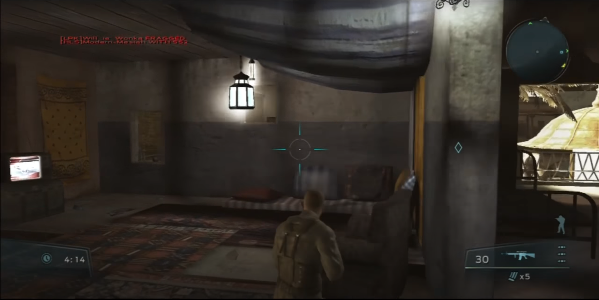

# A2
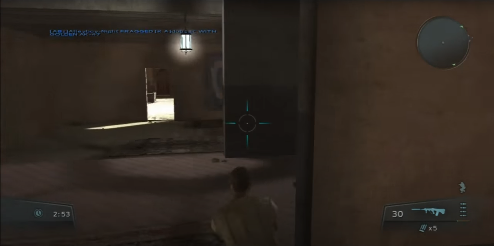

# A3
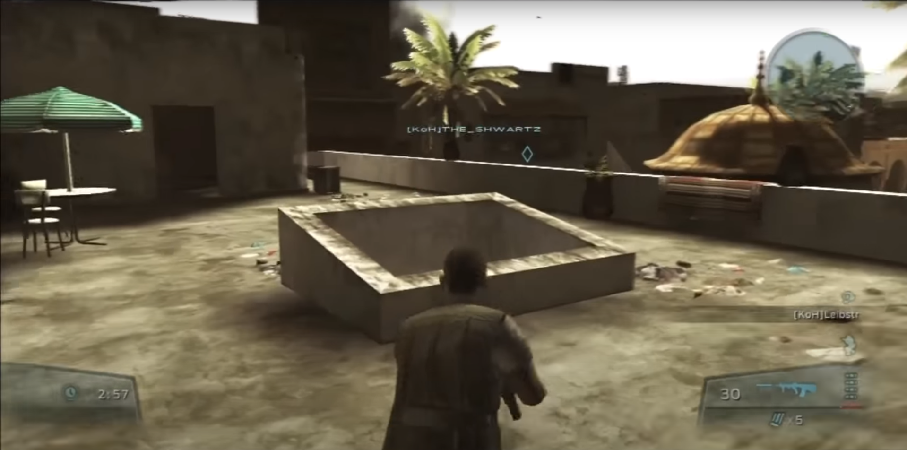

# A4
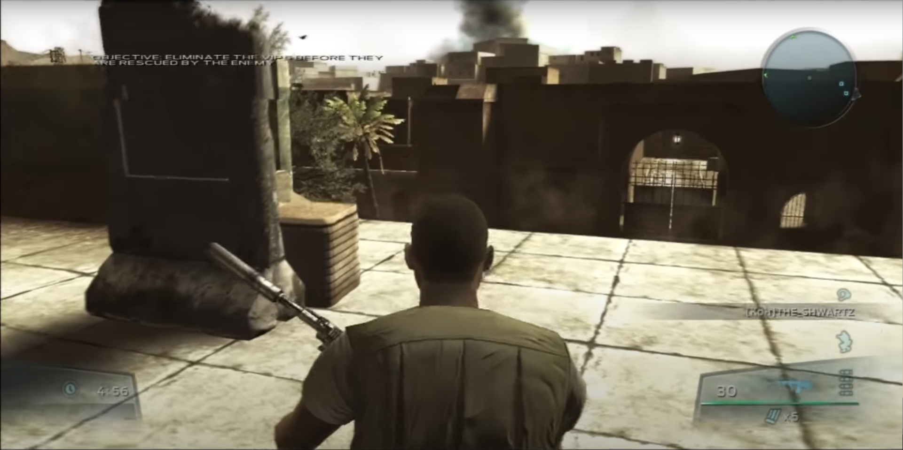

# A5
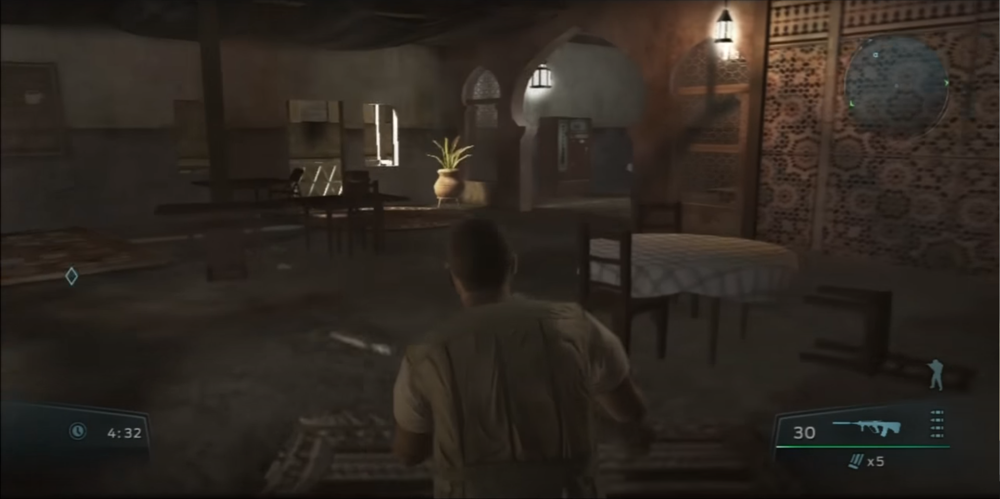

# A6
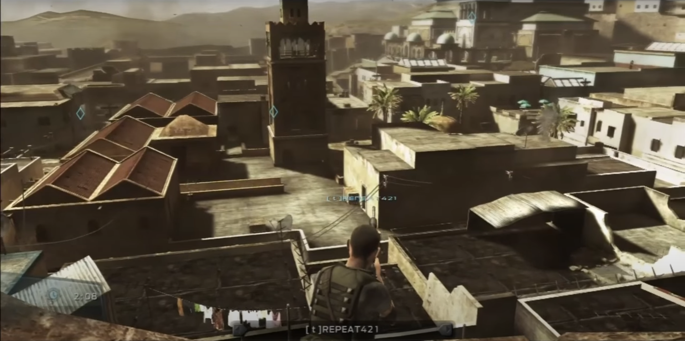

# A7
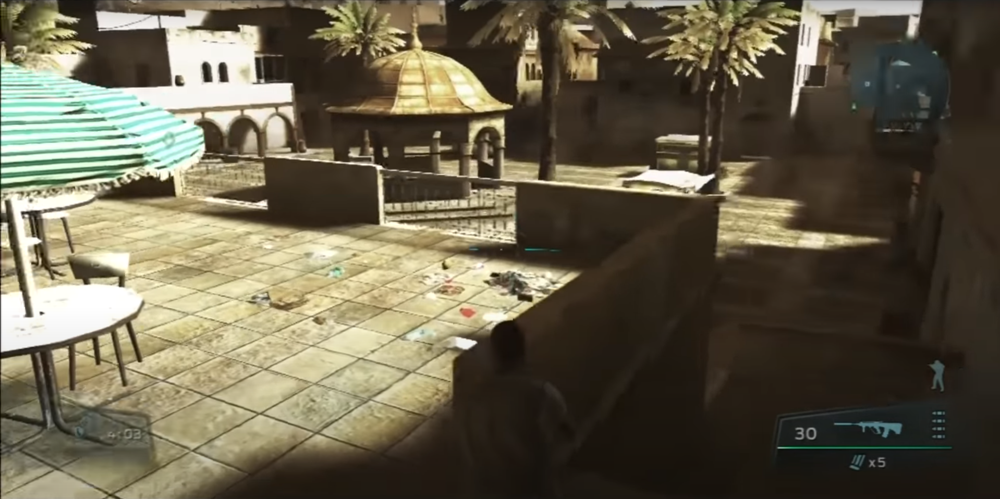

# G1
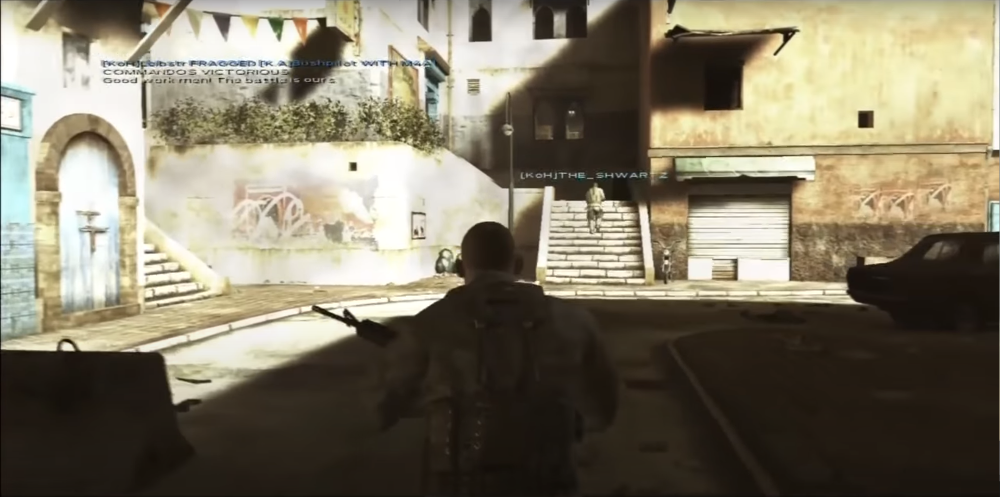

# G2
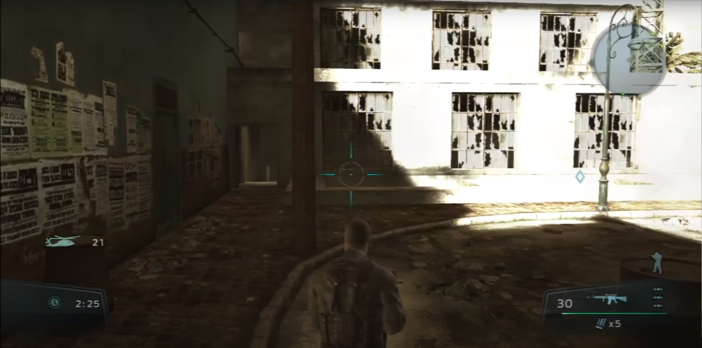

# G3
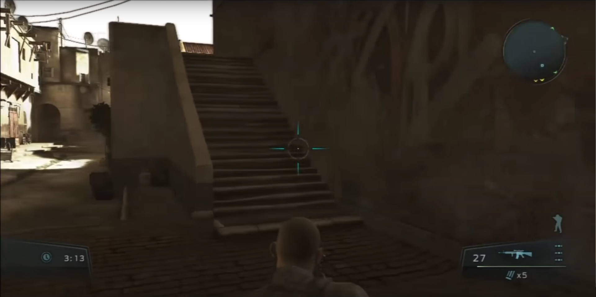

# G4
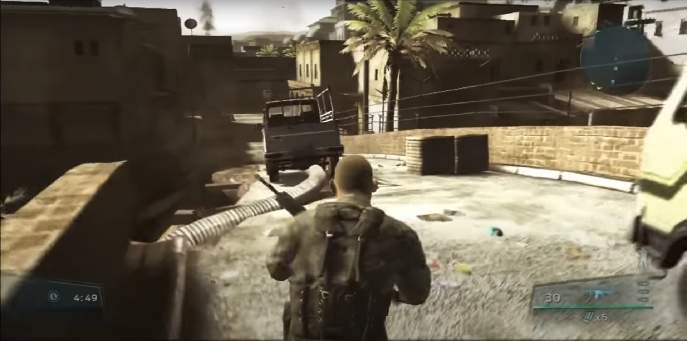

# G5

# G6

# G7

# G8

# G9

# G10

# G11

# G12

# G13

# G14

# G15

# G16

# G17

# G18

# G19

# G20

# G21

# G22

# G23

# G24

# G25

